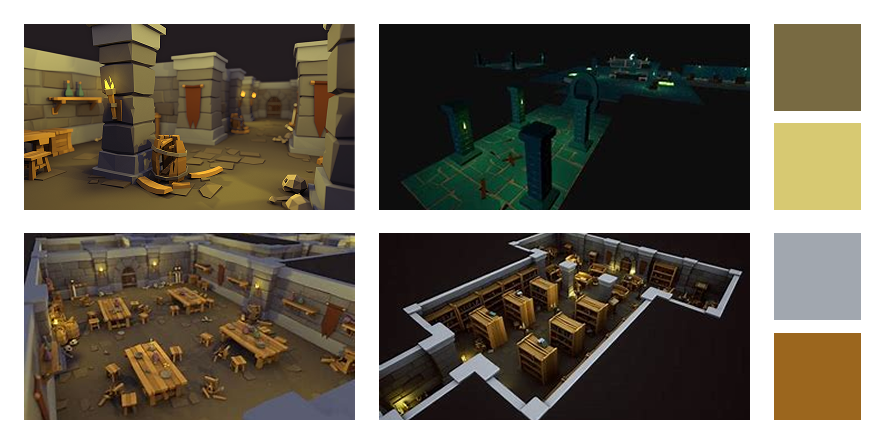
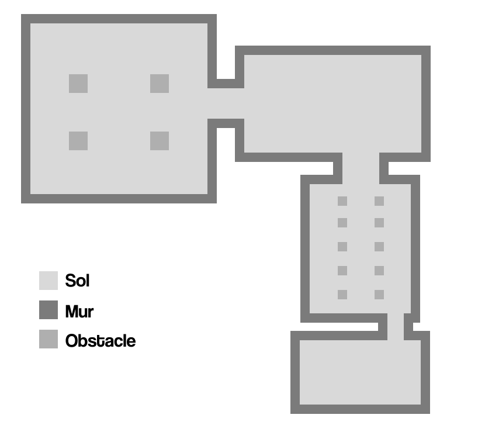
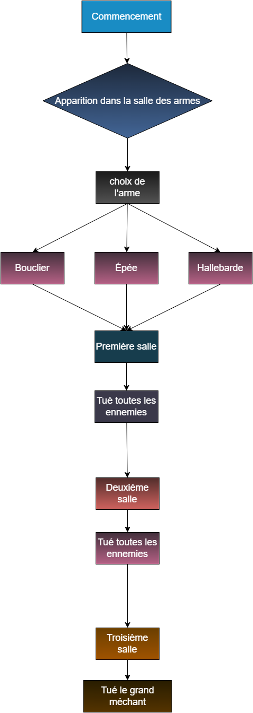

# EN CONSTRUCTION
Projet Jeu Vr du cours Réalité Mixte

Jouer en tant qu'aventurier pris au piège dans un donjon. Il devra survivre aux nombreux ennemis qui cherchent à le vaincre et atteidre la sortie en vie.

# Description écrite

Le joueur est amené à traverser un donjon rempli de cranes maléfiques. Il doit se diriger vers la sortie en se battant contre les hordes d'ennemis. Dans les différentes zones du jeu, le joueur devra vaincre les cranes en les touchant avec son arme (ou ses poings) et devra se défendre face à leur assaut (projectile de feu) en bloquant ou en esquivant.

## Gameplay loop Exemple VR

<ul>
<li> Attaquer à l'aide de son épée (balayer le bras en direction de la cible)  </li>
<li> Se protéger des projectiles en adoptant une position de parade (se mettre en position de parade "Épée à 90deg") </li>
<li> Esquiver les attaques ennemies (bouger à l'aide du joystick et/ou physiquement) </li>
</ul>
  
## Gameplay loop Exemple TouchDesigner

<ul>
<li> Controller la vitesse des cranes (controlle la vitesse avec un fader) </li>
<li> Déclencer les attaques des cranes (le jouer choisit quand les cranes attaquent)  </li>
<li> Controller l'environnement ?? (le joueur peut enclencher des zones dangereuses en les sélectionnant sur une carte) </li>
</ul>

# Moodboards 

## Environnement

## Ennemis

## Joueur

## Objet(s) à modeliser

# Moodboard Sonore

## Ambiance sonore

## Bruitage

https://youtu.be/SwD4SDnL1xE
 
https://youtu.be/FJGdoPmspiU
 
https://youtu.be/tKm9lhP7cwo
 
https://youtu.be/XPPEuhZIuAE
 
https://youtu.be/AlCUdSTxe9k

# Carte

# Schema d'Intéractivité

